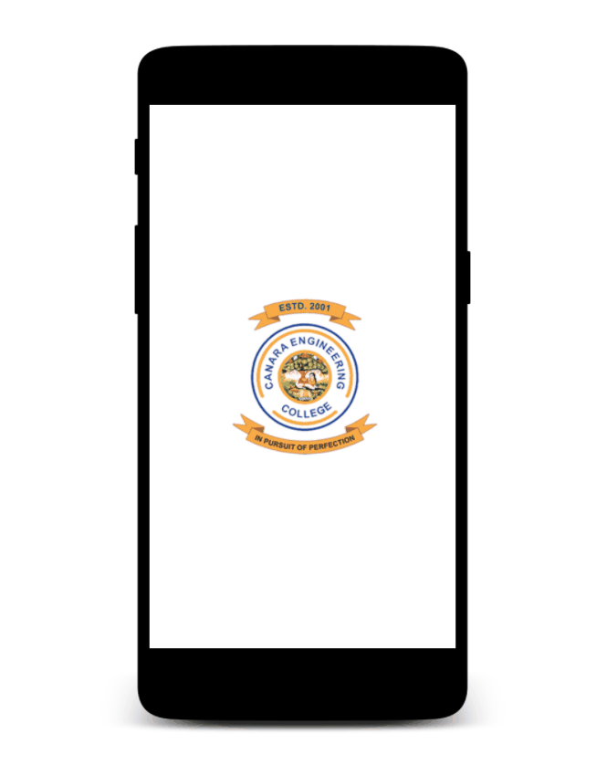

## Screenshots

  

Cansis is a modded Android client to check Announcements, Attendance, Marks, and other updates from college.

## Improvements

- One-time login &#x1F510;
- Push notifications &#x1F514;
- Forgot password? &#x1F914;
- Performance tweaks &#x1F4F1;
- Dark mode &#x1F576;
- Offline Persistance &#x1F30E;

## Dependencies

Cansis uses a number of open source projects:
- [Material](https://material.io/develop/android/docs/getting-started) - Google's Material UI
- [shimmer-android](https://github.com/facebook/shimmer-android) - Loading animation
- [Glide](https://github.com/bumptech/glide) - Loading images
- [Volley](https://github.com/google/volley) - Network requests
- [GSON](https://github.com/google/gson) - JSON Serialization/Deserialization
- [LoadingButtonAndroid](https://github.com/leandroBorgesFerreira/LoadingButtonAndroid) - Fancy loading button
- [CircleImageView](https://github.com/hdodenhof/CircleImageView) - Circular ImageView
- [commons-text](https://commons.apache.org/proper/commons-text/) - Apache Commons Text
- [intentanimation](https://github.com/hajiyevelnur92/intentanimation) - Animated intents
- [AttributionPresenter](https://github.com/franmontiel/AttributionPresenter) - Attributions
- [ZoomInImageView](https://github.com/zolad/ZoomInImageView) - Elastic Zoom
- [VerticalStepperForm](https://github.com/ernestoyaquello/VerticalStepperForm) - Vertical Stepper
- [android-otpview-pinview](https://github.com/mukeshsolanki/android-otpview-pinview) - OTP textfield
- [lottie-android](https://github.com/airbnb/lottie-android) - Render After Effects animations natively
- [ReactiveNetwork](https://github.com/pwittchen/ReactiveNetwork) - Listening network connection state
- [android-play-safetynet](https://github.com/googlesamples/android-play-safetynet) - reCAPTCHA
- [Firebase](https://github.com/firebase/quickstart-android) - Firebase
- [Sendgrid](https://github.com/sendgrid/sendgrid-java) - Sendgrid

Cansis requires Android 5+ to run

## Implementaion

##### Notifications

- Every 5 minutes a python script runs on [AWS Lambda](https://aws.amazon.com/lambda/) which hits college's `Announcements` Endpoint, compares current JSON with the previous one which is stored in [DynamoDB](https://aws.amazon.com/dynamodb/), if there is an new update Lambda calls [Firebase Cloud Messaging](https://firebase.google.com/docs/cloud-messaging) to send push notifcation to clients

##### OTP
 - After reCAPTCHA verification, OTP is generated on device (i know, bad choice 	&#x1F605;), its stored in Firestore and mailed to verifed email in a HTML template through Twilio's [Sendgrid](https://sendgrid.com/), then input is compared with Firestore and validated
 

##### Force Update/Discontinue
- Since the app is not published on Playstore, built a backup plan to force user to update to latest version or even entirely disable the app using [Remote Config](https://firebase.google.com/docs/remote-config)

##### Web Scraping
 - `Marks` and `Attendace` can be fetched via API but it returns details of all previous semesters which almost took a minute on average, but the same data is available on college's website for a particular semester, which has better response time, so used web scraping (on device) to get these data from website
